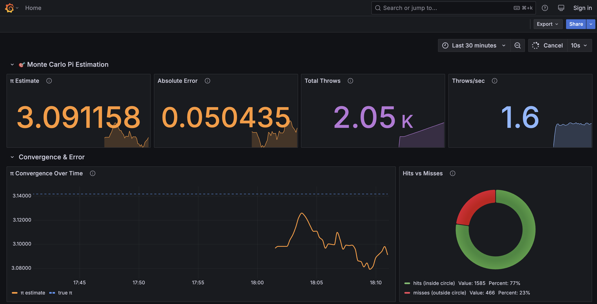
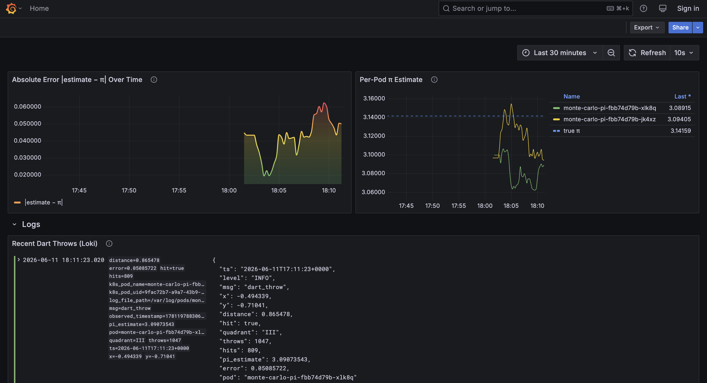

# Kubernetes Monitoring Stack — Grafana + Prometheus + Loki

A production-style monitoring stack deployed on a local Kubernetes cluster using **kind** (Kubernetes in Docker). Everything is configuration-as-code — no manual UI steps required.

## Architecture

```
┌──────────────────────────────────────────────────────────────┐
│                       kind cluster                           │
│                                                              │
│              ┌────────────┐                                  │
│              │  Grafana    │──► Dashboard                     │
│              │   :3000     │                                  │
│              └──┬─────┬───┘                                  │
│        queries  │     │  queries                             │
│       ┌─────────┘     └──────────┐                           │
│       ▼                          ▼                           │
│  ┌──────────┐             ┌──────────┐                       │
│  │Prometheus │             │   Loki   │                       │
│  │  :9090    │             │  :3100   │                       │
│  └────┬─────┘             └────▲─────┘                       │
│       │                        │ OTel pushes logs (OTLP)      │
│       │ scrapes /metrics  ┌────┴─────┐  tails /var/log/pods  │
│       │                   │   OTel   │◄──────────┐           │
│       │                   │Collector │(DaemonSet)│           │
│       │                   └──────────┘           │           │
│       ▼                                          │           │
│  ┌──────────────┐   stdout/stderr ──► CRI log ───┘           │
│  │ Monte Carlo  │                                            │
│  │  Pi Simulator│  (2 replicas, metrics + logs)              │
│  └──────────────┘                                            │
└──────────────────────────────────────────────────────────────┘
```

## Components

| Component   | Version | Purpose                                  | Access                |
|-------------|---------|------------------------------------------|-----------------------|
| Grafana        | 11.6.0  | Dashboards & visualization               | http://localhost:3000  |
| Prometheus     | 3.4.1   | Metrics collection & storage             | http://localhost:9090  |
| Loki           | 3.5.0   | Log aggregation                          | Internal (ClusterIP)  |
| OTel Collector | 0.127.0 | Log collection agent (DaemonSet, contrib) | Internal              |

## Prerequisites

- **macOS or Linux**
- **Docker runtime** — [Docker Desktop](https://www.docker.com/products/docker-desktop/) or [Colima](https://github.com/abiosoft/colima) (must be running before deploy)
- **kubectl** and **kind** — installed automatically by `./scripts/00-prerequisites.sh` on macOS with Homebrew; on Linux, install manually
- ~4 GB RAM available for the cluster

## Quick Start

**macOS (Homebrew):**

```bash
# 1. Install prerequisites (Docker CLI, kubectl, kind)
./scripts/00-prerequisites.sh

# 2. Create the kind cluster
./scripts/01-create-cluster.sh

# 3. Deploy the full monitoring stack
./scripts/02-deploy-stack.sh

# 4. Verify everything is working
./scripts/03-verify.sh
```

**Linux:** install Docker, kubectl, and kind manually, then run steps 2–4 above.

The verify script checks pod health, Grafana/Prometheus/Loki APIs, provisioned datasources and dashboards, Prometheus scrape targets, Monte Carlo metrics, Loki log ingestion, and external access via localhost.

After deployment:
- **Grafana**: http://localhost:3000 (login: `admin` / `admin`)
- **Prometheus**: http://localhost:9090

Both URLs are exposed via kind `extraPortMappings` (NodePort `30300` → host `:3000`, NodePort `30900` → host `:9090`). No port-forwarding required.

For submission details and interview talking points, see [SOLUTION.md](SOLUTION.md) and [REFLECTIONS.md](REFLECTIONS.md).

## Project Structure

```
k8s-monitoring-stack/
├── SOLUTION.md                        # 1-pager: architecture, decisions, limitations
├── REFLECTIONS.md                     # Challenges, feedback, interview notes
├── kind-cluster.yaml                  # Kind cluster definition with port mappings
├── .github/workflows/ci.yaml          # GitHub Actions: kind + deploy + verify
├── app/
│   └── simulator.py                   # Monte Carlo Pi estimator (Python source)
├── dashboards/
│   ├── cluster-overview.json          # Infrastructure monitoring dashboard
│   └── monte-carlo-pi.json           # Monte Carlo Pi estimation dashboard
├── screenshots/
│   ├── metrics-1.png                  # Dashboard: π estimate, convergence, hits/misses
│   └── metrics-2.png                  # Dashboard: per-pod estimates, Loki logs
├── manifests/
│   ├── namespace/
│   │   └── namespace.yaml             # monitoring namespace
│   ├── grafana/
│   │   ├── configmap.yaml             # grafana.ini configuration
│   │   ├── dashboard-provisioning.yaml# Dashboard auto-discovery config
│   │   ├── datasource-provisioning.yaml# Prometheus + Loki datasources
│   │   ├── deployment.yaml            # Grafana Deployment
│   │   ├── pvc.yaml                   # Persistent storage
│   │   └── service.yaml               # NodePort service (port 30300→3000)
│   ├── prometheus/
│   │   ├── configmap.yaml             # scrape_configs for self, grafana, loki, k8s
│   │   ├── rbac.yaml                  # ServiceAccount + ClusterRole
│   │   ├── deployment.yaml            # Prometheus Deployment
│   │   ├── pvc.yaml                   # Persistent storage
│   │   └── service.yaml               # NodePort service (port 30900→9090)
│   ├── loki/
│   │   ├── configmap.yaml             # Loki server + schema configuration
│   │   ├── deployment.yaml            # Loki Deployment
│   │   ├── pvc.yaml                   # Persistent storage
│   │   └── service.yaml               # ClusterIP service
│   ├── otel-collector/
│   │   ├── configmap.yaml             # Filelog receiver + OTLP exporter to Loki
│   │   ├── rbac.yaml                  # ServiceAccount + ClusterRole
│   │   └── daemonset.yaml             # OTel Collector DaemonSet
│   └── monte-carlo-pi/
│       └── deployment.yaml            # Monte Carlo Pi deployment (mounts app/ via ConfigMap)
└── scripts/
    ├── 00-prerequisites.sh            # Install Docker, kubectl, kind
    ├── 01-create-cluster.sh           # Create kind cluster
    ├── 02-deploy-stack.sh             # Deploy all manifests in order
    ├── 03-verify.sh                   # Health checks & validation
    └── 99-teardown.sh                 # Delete cluster
```

## Design Decisions

### Why kind?
- Runs a full Kubernetes cluster inside Docker containers
- No VM overhead (unlike minikube)
- Supports multi-node clusters, port mappings, and storage
- Widely used in CI/CD for Kubernetes testing

### Why raw manifests instead of Helm charts?
- The assignment explicitly asks to create manifests from scratch
- Demonstrates understanding of each Kubernetes resource type
- No abstraction layer hiding what's actually deployed
- Easier to review and reason about

### Configuration-as-Code
Everything is declarative:
- **Datasources**: Provisioned via ConfigMap → mounted into Grafana's provisioning directory
- **Dashboards**: JSON files loaded via Grafana's file-based provisioning
- **Prometheus scrape targets**: Defined in ConfigMap, with Kubernetes SD for auto-discovery
- **Loki**: Configured via YAML ConfigMap, no manual setup
- **OTel Collector**: Filelog receiver tails pod logs, exports to Loki via OTLP

### Security Considerations
- Grafana, Prometheus, and Loki run as non-root users (`runAsNonRoot: true`)
- Init containers briefly run as root to fix PVC permissions before the main container starts
- RBAC with least-privilege: Prometheus and OTel Collector get read-only access to the K8s API
- Resource limits set on all containers to prevent runaway usage
- Grafana anonymous auth enabled with Viewer role (local demo only; disable in production)

### What's NOT automated (manual steps)
- Installing and starting a Docker runtime (Docker Desktop GUI, or `colima start` for Colima)
- On Linux: installing Docker, kubectl, and kind manually (no Homebrew script)

## Dashboards

### Monte Carlo Pi Estimation (home dashboard)

A Monte Carlo simulator throws random darts at a unit circle inscribed in a 2x2 square. The ratio of hits (inside circle) to total throws converges to π/4, giving us an estimate of Pi. The dashboard tells this story in real time:

1. **π Estimate** — current Monte Carlo estimate (converges to 3.14159…)
2. **Absolute Error** — |estimate − π|, shrinking over time
3. **Total Throws** — cumulative dart count across all replicas
4. **Throws/sec** — throughput rate
5. **π Convergence Over Time** — estimate approaching true π (dashed reference line at π)
6. **Hits vs Misses** — donut chart of cumulative hit/miss counts
7. **Absolute Error Over Time** — error magnitude shrinking as more darts are thrown
8. **Per-Pod π Estimate** — each replica converges independently
9. **Recent Dart Throws (Loki)** — live structured JSON log stream

### Cluster Overview

Infrastructure monitoring with Prometheus targets up/down, scrape duration, samples scraped per job, target status table, Loki ingestion rate, and a recent logs panel.

### Screenshots

Monte Carlo Pi dashboard (Prometheus metrics + Loki logs):





## Teardown

```bash
./scripts/99-teardown.sh
```

This deletes the kind cluster `monitoring-lab` and all associated resources. PVCs and data are destroyed. When run non-interactively (e.g. in CI), teardown proceeds without confirmation.

## CI

GitHub Actions runs the full deploy and verify pipeline on every push/PR to `master`:

1. Create kind cluster from `kind-cluster.yaml`
2. Run `./scripts/02-deploy-stack.sh`
3. Run `./scripts/03-verify.sh`

See [`.github/workflows/ci.yaml`](.github/workflows/ci.yaml).

## Challenges & Reflections

See [REFLECTIONS.md](REFLECTIONS.md) for detailed feedback on the process, challenges encountered, and what I would improve with more time.
